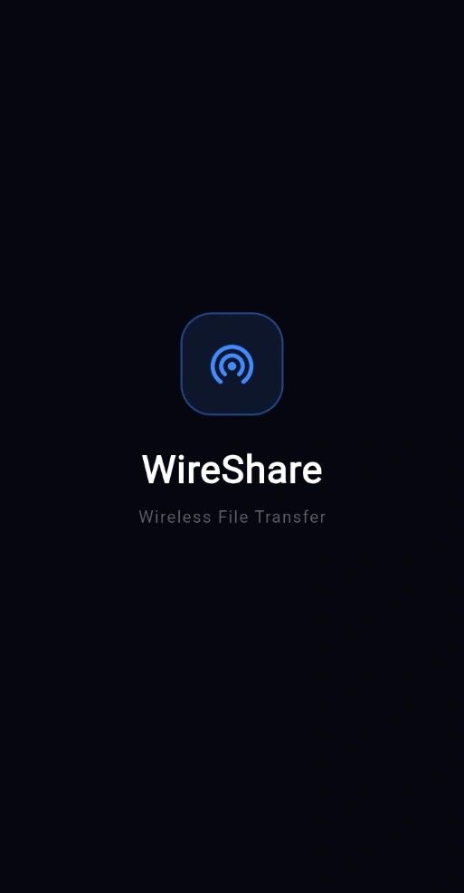
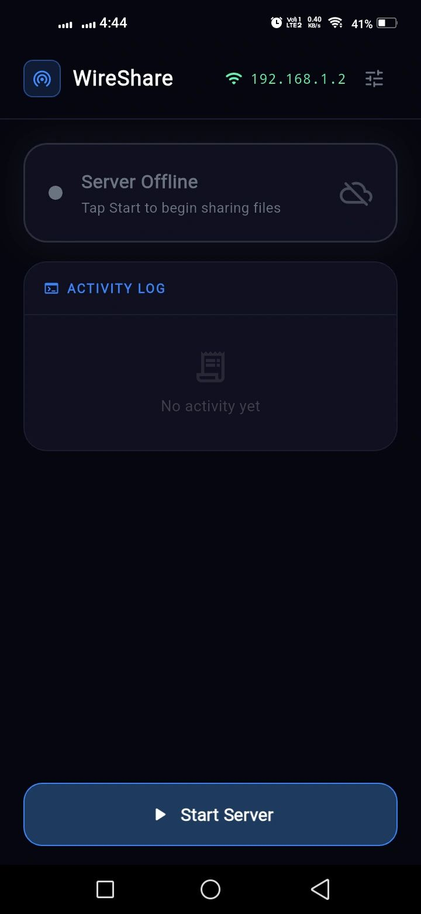
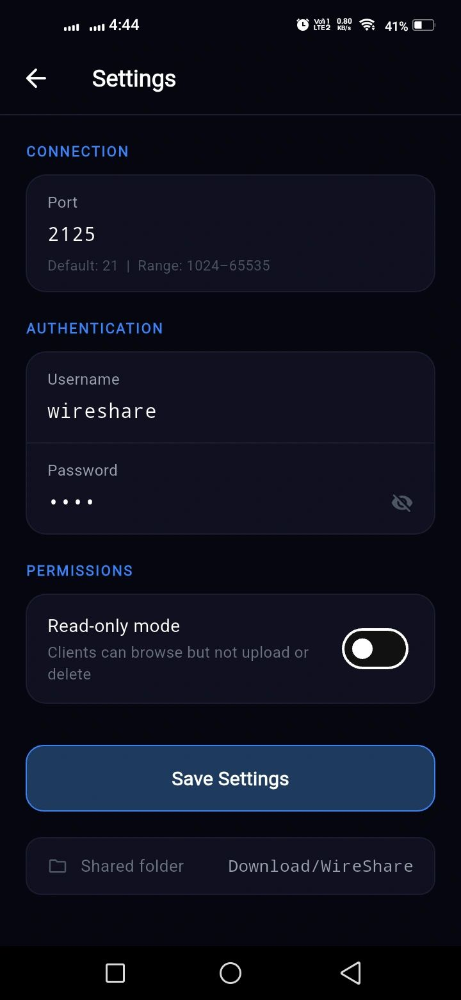
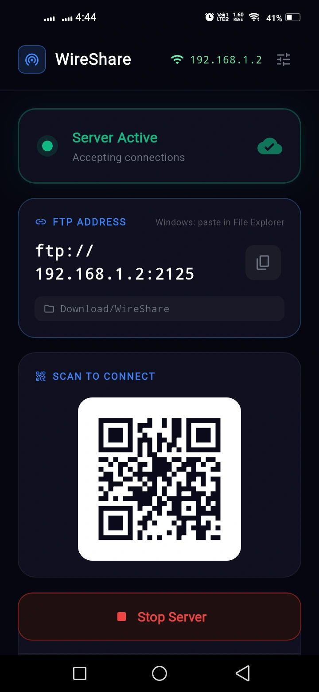

# WireShare

  
  
  
  

I built this because I was tired of plugging in a USB cable every time I needed to move files between my phone and PC. I wanted something instant, something that just works on the same WiFi without installing anything on the desktop side.

So I built WireShare. It runs an FTP server on your Android phone and exposes your storage to Windows File Explorer over your local network. You open the app, tap Start Server, type the IP address shown on screen into File Explorer, and your phone shows up like a network drive. That is genuinely it.

## What you can do

Once connected from Windows File Explorer you get full access. You can browse every folder on your phone, copy files to your PC, paste files from your PC onto your phone, delete things, rename things. It feels exactly like browsing a USB drive except there is no wire involved and the speed is actually better than USB 2.0 on a decent WiFi router.

## How to connect

1. Open WireShare on your phone and tap Start Server
2. You will see an address like ftp://192.168.1.6:2121 on screen
3. Open Windows File Explorer and type that address in the address bar
4. Enter the username and password shown in Settings
5. Done. Your phone storage is now open in front of you

## Speed

On a standard home WiFi router I was seeing 20 to 50 MB per second. On a 5GHz router it gets closer to 80 MB per second. This is purely LAN so there is no cloud in the middle slowing things down.

## Built with

Flutter, Dart, GetX, MVVM architecture and the packages below.

| Package | Version | Why I used it | How it helped |
|---|---|---|---|
| get | ^4.7.3 | State management and navigation | Manages all reactive UI state, routing between screens and dependency injection with almost zero boilerplate |
| ftp_server | ^2.3.2 | The core of the whole app | Runs a standards compliant FTP server right inside the Flutter app so Windows File Explorer can connect to the phone directly |
| network_info_plus | ^7.0.0 | Get the phone WiFi IP | Reads the current WiFi IP address so the app can show the correct FTP address to the user |
| permission_handler | ^12.0.1 | Storage permissions | Handles requesting All Files Access on Android 11 and above which is required to expose phone storage over FTP |
| shared_preferences | ^2.5.5 | Save user settings | Persists port, username, password and read only mode so settings survive app restarts |
| qr_flutter | ^4.1.0 | QR code display | Generates a QR code from the FTP address so users can scan it instead of typing the address manually |
| flutter_foreground_task | ^9.2.2 | Keep server alive in background | Runs an Android foreground service so the FTP server keeps working even when the app is minimized |
| device_info_plus | ^12.4.0 | Detect Android version | Checks the Android SDK version to decide which storage permission flow to use for that specific device |

A huge thanks to the creators and maintainers of every package in this list. This app would not exist without the work you have already done and shared with everyone for free.

## What I want to add next

I want to add a QR code scanner so you do not have to type the address manually. I also want to add FTPS so the connection is encrypted, transfer speed stats inside the app, iOS support, and maybe a simple web browser UI as an alternative to File Explorer for people on Mac or Linux.

## Setup for developers

Clone the repo, run flutter pub get, connect an Android device and run flutter run. You will need to grant All Files Access permission on first launch. The app will guide you through it.

## License

MIT

## Getting Started

This project is a starting point for a Flutter application.

A few resources to get you started if this is your first Flutter project:

- [Lab: Write your first Flutter app](https://docs.flutter.dev/get-started/codelab)
- [Cookbook: Useful Flutter samples](https://docs.flutter.dev/cookbook)

For help getting started with Flutter development, view the
[online documentation](https://docs.flutter.dev/), which offers tutorials,
samples, guidance on mobile development, and a full API reference.
